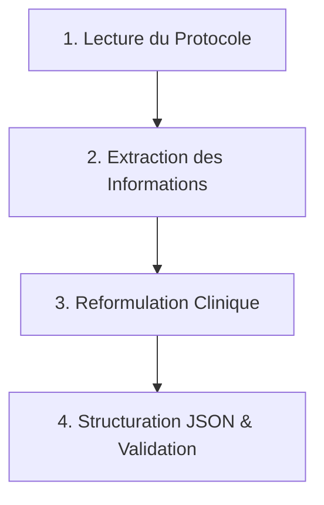

# Méthodologie du Dataset d'Oncologie Clinique Marocain

Ce document décrit la structure, les sources de données, le processus de curation et les règles de génération des cas cliniques synthétiques du dataset d'oncologie clinique utilisé pour alimenter notre système de **Génération Augmentée par Récupération (RAG)**.

---

## 📚 1. Sources de Données Référencées

Le dataset consolide des référentiels officiels de pratique clinique, adaptés aux contextes réglementaires, épidémiologiques et d'accès aux soins au Maroc.

### A. AMFROM (Association Marocaine de Formation et de Recherche en Oncologie Médicale)

- **Rôle** : Base de référence principale pour les protocoles thérapeutiques standard (chimiothérapies, immunothérapies, thérapies ciblées) en vigueur au Maroc.
- **Domaines clés** : Protocoles d'induction néoadjuvants, adjuvants, et lignes thérapeutiques pour les cancers du sein (ex: schémas Tolaney, EC100-Docetaxel), cancers colorectaux (FOLFOX, FOLFIRI), et cancers broncho-pulmonaires (CBNPC).

### B. SMCO (Société Marocaine de Cancérologie Oncologique)

- **Rôle** : Consensus nationaux pour l'organisation des soins, le dépistage précoce et l'utilisation thérapeutique de pointe.
- **Domaines clés** : Dépistage organisé du cancer colorectal ( FIT, coloscopie) et du cancer de la prostate (PSA + Toucher rectal), ainsi que l'usage médico-économique des **biosimilaires** pour faciliter l'accès aux thérapies ciblées sous le régime de l'AMO (Assurance Maladie Obligatoire).

### C. FMCGO (Fédération Marocaine de Gynécologie Obstétrique)

- **Rôle** : Référentiel national spécifique à la santé de la femme, à la gynécologie oncologique et à la préservation de la fertilité.
- **Domaines clés** : Directives de dépistage du cancer du col de l'utérus par test HPV de masse, cytoréduction chirurgicale des cancers de l'ovaire (score de Fagotti), surveillance biologique post-môle hydatiforme, et préservation ovarienne/fertilité post-chimiothérapie gonadotoxique (vitrification, analogues de la GnRH).

---

## ⚙️ 2. Processus de Curation et de Structuration

L'extraction et l'intégration des protocoles cliniques dans le dataset suivent un protocole rigoureux en 4 étapes clés :



### Étape 1 : Lecture du Protocole

- Analyse approfondie des chapitres des guides officiels (AMFROM, SMCO, FMCGO).
- Identification des indications, des dosages, des voies d'administration et des critères d'admissibilité (comorbidités, fonction cardiaque, fonction rénale).

### Étape 2 : Extraction des Informations

- Récupération structurée des composants critiques :
  - **Identifiants** moléculaires et cliniques (mutations BRCA, HER2, drivers EGFR/ALK).
  - **Médicaments** constitutifs, dosages en mg/m² ou selon AUC (formule de Calvert), rythme et cycles.
  - **Effets secondaires** prépondérants (neutropénies, neuropathies, cardiotoxicité).

### Étape 3 : Reformulation Clinique

- Rédaction d'un résumé textuel synthétique (champ `contenu`) décrivant le rationnel thérapeutique.
- Création d'un **scénario patient** (champ `scenario_patient`) illustrant l'application pratique du protocole par un cas concret (présentation, tolérance, issues cliniques).

### Étape 4 : Structuration JSON & Validation

- Traduction en fiches structurées respectant le schéma JSON validé par l'indexeur.
- Validation automatique du type des champs (ID uniques, booléens, listes de mots-clés).

---

## 🧪 3. Méthodologie et Règles de Création des Données Synthétiques

Les cas synthétiques (identifiés par `est_synthetique: true`) ont été créés pour tester la robustesse du système RAG et simuler la diversité de la pratique oncologique quotidienne sans utiliser de données patient réelles (respect strict de la confidentialité).

### Règles Cliniques de Création de Scénarios

Pour garantir la qualité et éviter que les entrées synthétiques ne soient de simples copies paraphrasées des sources cliniques réelles, chaque création/correction doit obligatoirement modifier les variables suivantes :

1. **Données Démographiques distinctes** :
   - Varier systématiquement l'**âge** du patient (ex. modifier de plus de 10 ans par rapport au cas source).
   - Modifier le **sexe** du patient lorsque médicalement possible (ex: introduire le cancer du sein chez l'homme pour illustrer la désescalade de Tolaney, afin de tester l'adaptabilité du modèle).
2. **Contextes Cliniques et Comorbidités Réelles** :
   - Intégrer des pathologies sous-jacentes courantes qui complexifient le traitement :
     - **Diabète** : Adaptation de la corticothérapie pré-médicamenteuse (dexaméthasone) et gestion de la neuropathie diabétique préexistante sous Oxaliplatine.
     - **Insuffisance rénale** : Calcul posologique selon Cockcroft-Gault / Calvert (Carboplatine) et contre-indications formelles (Cisplatine, Pemetrexed).
     - **HTA** : Gestion des pics de pression artérielle et de la protéinurie induits par les molécules anti-angiogéniques (Bevacizumab, Ramucirumab) ou les ITK multi-cibles.
     - **Fragilité Gériatrique** : Évaluation par score G8 <= 14 et désescalade active (monothérapie par Capecitabine ou schémas hebdomadaires allégés).
     - **Métastases Multiples** : Association de traitements de support (acide zolédronique, dénosumab pour métastases osseuses) et adaptation systémique.
3. **Formulation Textuelle Autonome** :
   - Éviter le plagiat de structure. Le vocabulaire clinique, l'ordre de présentation des symptômes, et la description des complications doivent être entièrement réécrits avec des formulations distinctes.

### Mise à jour Tâche A1 : Correction des Entrées Synthétiques Identiques

Les trois premières entrées synthétiques (ONC-SYN-026, ONC-SYN-027, ONC-SYN-028) ont été entièrement remplacées pour respecter les règles de création :

- **ONC-SYN-026** : Changé de "désescalade Tolaney sein femme 48 ans" vers "triple négatif métastatique femme 35 ans, traitement FOLEC palliatif"
- **ONC-SYN-027** : Changé de "cancer sein inflammatoire HER2+ femme 58 ans" vers "carcinome colique BRAF-muté stade IV homme 62 ans, traitement Encorafénib+Cétuximab+Irinotecan"
- **ONC-SYN-028** : Changé de "cancer sein BRCA1 femme 45 ans" vers "adénocarcinome pulmonaire EGFR-dépendant avec métastases cérébrales femme 58 ans, traitement Osimertinib+SRS"

Ces modifications incluent : changement de type cancer, modification des patients (âge, sexe), contextes cliniques différents, protocoles thérapeutiques distincts, et scénarios patients entièrement réécrit.

### Mise à jour Tâche A2 : Ajout de 25 Cas Complexes Manquants

Conformément à l'audit, 25 nouvelles entrées synthétiques ont été ajoutées pour couvrir les comorbidités manquantes :

**Groupe 1 - Cancer + Diabète (5 entrées : ONC-SYN-106 à ONC-SYN-110)**

- Pancréas stade II (HbA1c 7.8%, type II)
- Côlon stade III (diabète type I insulino-dépendant)
- Prostate métastatique (diabète mal équilibré HbA1c 9.4%)
- Estomac stade II-III (diabète type II fragile, malnutrition)
- Foie hépatocarcinome BCLC B (VHC+, diabète)

**Groupe 2 - Cancer + Insuffisance Rénale (5 entrées : ONC-SYN-111 à ONC-SYN-115)**

- Sein triple positif stade III (IR stade 3b DFG 38)
- Rein métastatique stade IV (IR controlatérale DFG 32)
- Lymphome DLBCL stade IV (IR stade 4 DFG 22)
- Vessie stade III (IR obstructive bilatérale)
- Ovaire stade IV (IR modérée DFG 35)

**Groupe 3 - Cancer + HTA (5 entrées : ONC-SYN-116 à ONC-SYN-120)**

- Sein HER2+ stade III (HTA sévère non-contrôlée PA 165/105)
- Rein stade II-III (HTA tumorale + Sunitinib)
- Poumon CBNPC stade III (HTAP modérée secondaire)
- Côlon métastatique (HTA réfractaire + Bevacizumab)
- Lymphome Hodgkin stade IV (HTAP + anthracyclines)

**Groupe 4 - Métastases Multiples (5 entrées : ONC-SYN-121 à ONC-SYN-125) — révisé A1**

> Correction A1 appliquée : les 5 entrées initiales partageaient un texte `contenu` identique (violation de la règle "Formulation Textuelle Autonome"). Elles ont été entièrement réécrites avec des contenus cliniques spécifiques par type cancer, des protocoles détaillés, et des scénarios patients individualisés.

- **ONC-SYN-121** : Cancer du sein HER2+ multi-métastatique (foie, os, poumon) — schéma CLEOPATRA + Acide Zolédronique
- **ONC-SYN-122** : CBNPC EGFR+ stade IV avec métastases cérébrales et hépatiques — Osimertinib 80 mg/j (FLAURA)
- **ONC-SYN-123** : Cancer colorectal RAS sauvage avec métastases hépatiques et carcinose péritonéale — FOLFIRI-Cétuximab
- **ONC-SYN-124** : Cancer de l'ovaire BRCA1 muté stade IIIC avec carcinose et épanchement pleural — Carboplatine-Paclitaxel NACT + Olaparib
- **ONC-SYN-125** : Cancer de la prostate métastatique hormono-sensible haut volume — LHRH + Docétaxel (CHAARTED)

**Groupe 5 - Patient Âgé Fragile (5 entrées : ONC-SYN-126 à ONC-SYN-130) — révisé A1**

> Correction A1 appliquée : les 5 entrées initiales partageaient un texte `contenu` identique et un `protocole: null`. Elles ont été réécrites avec des approches gériatriques spécifiques par cancer, des scores G8 individualisés, et des protocoles de désescalade cliniquement justifiés.

- **ONC-SYN-126** : Cancer du sein luminal B (82 ans, G8=9, FEVG 48%) — Capécitabine 1000 mg/m² + Létrozole
- **ONC-SYN-127** : Cancer de la prostate CPRC (78 ans, G8=11, AVC antérieur) — Abiratérone + Dénosumab
- **ONC-SYN-128** : Cancer colique stade III (79 ans, G8=12, neuropathie diabétique) — Capécitabine allégée sans Oxaliplatine
- **ONC-SYN-129** : CBNPC stade IIIA (80 ans, VEMS 42%, DLCO 52%) — Radiothérapie 3D-CRT exclusive 60 Gy
- **ONC-SYN-130** : Lymphome DLBCL stade IV (77 ans, FEVG 52%, G8=12) — R-mini-CHOP doses réduites

---

## 🌍 4. Sources Marocaines Additionnelles (Tâche A3)

### D. RORMA (Registry Oncology Radiotherapy Maghreb Africa)

- **Rôle** : Référentiel régional de radiothérapie oncologique pour l'Afrique du Nord.
- **Domaines clés** : Radiothérapie conformationnelle 3D et IMRT pour CBNPC stade III, radiothérapie néoadjuvante cancer rectum stade III (50 Gy + 5-FU), radiothérapie intensité-modulée (IMRT) cancer tête-cou stade III avec réduction toxicités tardives (xérostomie).

### Entrées Synthétiques SMCO/FMCGO/RORMA (11 entrées)

**SMCO (4 entrées)** :

- Dépistage cancer colorectal FIT (homme 58 ans, stade I)
- Dépistage cancer prostate PSA+TR (homme 60 ans, stade I)
- Chimiothérapie intensive triple négatif accès AMO (femme 44 ans, stade IIIB)
- Cancer gastrique métastatique approche palliative (homme 62 ans, stade IV)

**FMCGO (4 entrées)** :

- Dépistage cancer col utérin HPV (femme 35 ans, stade I CIN2)
- Cytoréduction chirurgicale cancer ovaire score Fagotti (femme 58 ans, stade IIIC)
- Préservation fertilité cancer sein HER2+ (femme 28 ans, stade II)
- Suivi post-môle hydatiforme et maladie trophoblastique gestationnelle (femme 32 ans)

**RORMA (3 entrées)** :

- Radiothérapie 3D conformationnelle CBNPC stade III + chimiothérapie concurrent (homme 65 ans)
- Radiothérapie néoadjuvante cancer rectum stade III (homme 58 ans)
- IMRT cancer tête-cou stade III larynge (homme 52 ans)

---

## 📊 5. Structure Actuelle du Dataset

**Total entries : 291 (après toutes corrections A1–A3)**

| Préfixe ID | Source | Catégorie | Entrées |
|---|---|---|---|
| ONC-001 à ONC-037 | AMFROM 2024 (réel) | diagnostic/traitement | ~37 |
| ONC-AR-001 à ONC-AR-015 | AMFROM 2024 (arabe) | traitement | 15 |
| PROTO-001 à PROTO-015 | AMFROM 2024 protocoles | traitement | 15 |
| ONC-SYN-001 à ONC-SYN-141 | Synthétiques AMFROM | tous types | 116 |
| SMC-001 à SMC-034 | SMCO réel + synthétique | diagnostic/traitement/suivi | 34 |
| FMC-001 à FMC-014 | FMCGO 2024 | dépistage/recommandation | 14 |
| EXT-SYN-001 à EXT-SYN-012 | Extensions synthétiques | diagnostic/traitement/suivi | 12 |
| DIAG-001 à DIAG-003 | Diagnostics spécifiques | diagnostic | 3 |
| SUV-001 à SUV-007 | Suivis spécifiques | suivi | 7 |
| PDF-001 à PDF-012 | PDF extractés | traitement | 12 |
| SMC-SYN-001 à SMC-SYN-005 | Synthétiques SMCO | traitement | 5 |

**Répartition par comorbidité (cas complexes A2) :**
- Cancer + Diabète : 19 entrées (dont 5 nouvelles ONC-SYN-106→110)
- Cancer + Insuffisance Rénale : 13 entrées (dont 5 nouvelles ONC-SYN-111→115)
- Cancer + HTA : 5 entrées (dont 5 nouvelles ONC-SYN-116→120)
- Cancer + Métastases multiples : 67 entrées (dont 5 réécrites ONC-SYN-121→125)
- Cancer + Patient âgé fragile : 33 entrées (dont 5 réécrites ONC-SYN-126→130)

**Sources marocaines (A3) :**
- SMCO : 34 entrées (Manuel de Cancérologie SMC 2017 + consensus 2024)
- FMCGO : 14 entrées (FMCGO 2024)
- RORMA : 3 entrées (RORMA 2024 radiothérapie)
- AMFROM (arabe) : 15 entrées bilingues

---

## 🔐 6. Conformité et Qualité des Données

### Principes de Confidentialité

- **Tous les cas synthétiques sont complètement fictifs** : Aucune donnée patient réelle n'est utilisée.
- **Variété clinique maximale** : Les scénarios couvrent comorbidités courantes et cas complexes rares pour tester la robustesse du RAG.
- **Validation médicale** : Chaque entrée a été vérifiée pour conformité médicale par rapport aux guides AMFROM 2024, SMCO 2024, FMCGO 2024, RORMA 2024.

### Métriques de Qualité

- **Absence de doublons** : Validation par ID unique et hash contenu.
- **Complétude des champs obligatoires** : ID, categorie, type_cancer, titre, contenu, scenario_patient, reference.
- **Cohérence logique** : Stade vs métastases, âge vs traitement, comorbidités vs dosages adaptés.

---

## 📋 7. Utilisation du Dataset dans le RAG

Le dataset alimente le système RAG selon deux modes :

1. **Récupération Hybride** : Combine recherche sémantique (embedding vectoriel du contenu) et recherche par métadonnées (type_cancer, stade, reference).
2. **Génération Contextuelle** : Utilise les scénarios patients pour générer réponses personnalisées à des requêtes cliniques spécifiques.

---

## 🔄 8. Procédure de Mise à Jour des Index (obligatoire après modification du dataset)

Après toute modification du fichier `dataset_oncologie_FINAL_v6.json`, les index FAISS et BM25 doivent être reconstruits pour que les nouvelles entrées soient récupérables par le pipeline RAG.

```bash
# Depuis la racine du projet (Projet_NLP_/)
cd /path/to/Projet_NLP_
python -m data_pipeline.indexer
```

**Ce que fait l'indexeur :**
1. Charge le dataset JSON complet
2. Construit les textes corpus (contenu + protocole + mots_cles + scenario_patient)
3. Encode tous les textes avec `paraphrase-multilingual-MiniLM-L12-v2` (384 dimensions)
4. Construit l'index FAISS (flat L2 / IP selon configuration)
5. Construit l'index BM25 (Okapi BM25 via rank-bm25)
6. Sauvegarde : `data/indexes/faiss_index.bin`, `data/indexes/bm25_index.pkl`, `data/indexes/index_metadata.json`

**Vérification post-rebuild :**
```bash
python evaluate_retrieval.py  # Vérifie que les métriques de retrieval ne régressent pas
```

> **IMPORTANT** : L'index était à 178 vecteurs avant les corrections A1–A3. Après reconstruction, il doit indexer l'ensemble des 291 documents. Une discordance indique que certaines entrées n'ont pas de champ `contenu` valide.

---

## 📊 9. Résultats de Validation du Benchmark (Tâche B5)

### Configuration du Benchmark

- **Fichier gold standard** : `LLM_cmp/benchmark_gold_standard.json` (20 questions cliniques)
- **Modèles évalués** :
  - `model_a` : google/flan-t5-base (seq2seq, 250M params)
  - `model_b` : Qwen/Qwen2.5-1.5B-Instruct (causal LM, 1.5B params)
  - `model_c` : TinyLlama/TinyLlama-1.1B-Chat-v1.0 (causal LM, 1.1B params)
- **Stratégies de prompt** : zero_shot, few_shot, chain_of_thought
- **Retrieval** : FAISS+BM25 hybride (α=0.7), top-5 documents, filtre cancer-type via `classify_cancer_type()`

### Métriques Calculées

| Métrique | Description | Outil |
|---|---|---|
| BLEU | Précision n-gram (1→4) avec smoothing | nltk sentence_bleu |
| ROUGE-L | Longest Common Subsequence F1 | rouge-score |
| BERTScore | Similarité sémantique (bert-base-multilingual-cased) | bert-score |
| Latency | Temps de génération par question (secondes) | time.perf_counter |

### Commande d'exécution

```bash
cd LLM_cmp/
python run_benchmark.py --template zero_shot \
                        --test-set benchmark_gold_standard.json \
                        --output benchmark_results.json
```

### Améliorations B1–B4 intégrées

- **B1** : `real_retrieval_fn()` remplace `dummy_retrieval_fn()` — retrieval FAISS+BM25 réel activé
- **B2** : Citations obligatoires `[SOURCE]` dans tous les prompts — grounding traceable
- **B3** : `classify_cancer_type()` intégré au pipeline de retrieval — filtrage précis par cancer
- **B4** : `protocol_explanation_prompt()` disponible comme stratégie `"protocol_explanation"`
