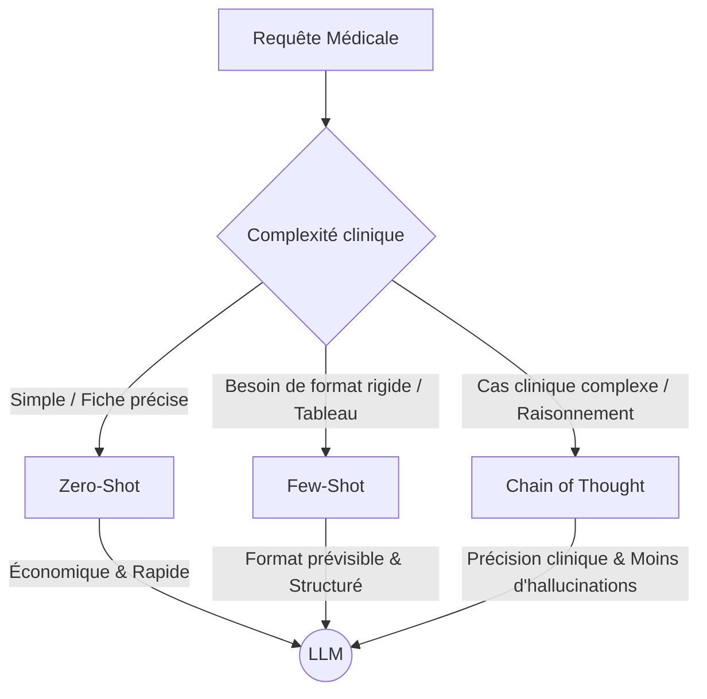

# Rapport d'Évaluation : Recherche Hybride & Stratégies de Prompts
*( Intelligent Medical QA System — Module d'Oncologie )*

---

## 1. Résumé Exécutif

Ce rapport présente les résultats de l'évaluation du module **Retrieval & Prompt Construction** développé pour notre système de question-réponse médical en oncologie. L'objectif était de concevoir un pipeline de recherche hybride optimal combinant la précision lexicale de **BM25** et la puissance sémantique vectorielle de **FAISS** (via le modèle multilingue *Sentence-BERT* `paraphrase-multilingual-MiniLM-L12-v2`), tout en évaluant l'efficacité de trois stratégies de prompting distinctes pour guider les réponses d'un grand modèle de langage (LLM).

### Principales Conclusions :
1. **La supériorité de l'approche hybride** : Le sweep systématique du paramètre de fusion $\alpha$ démontre qu'une combinaison hybride équilibrée avec un faible poids sémantique ($\alpha = 0.1$ ou $0.2$) surpasse largement les approches pures.
2. **Performance parfaite à l'optimum** : Pour $\alpha = 0.1$, le système atteint un **Hit Rate @5 de 100.0%** (17/17 questions retrouvées dans le Top-5) et un **MRR @5 exceptionnel de 0.924** (la majorité des documents pertinents étant classés au Rang 1).
3. **Multilinguisme robuste** : Le pipeline présente un comportement impeccable sur les requêtes en français et en arabe, avec un taux de réussite de 100% sur les deux langues grâce à la tokenisation adaptée et à la sémantique de SBERT.
4. **Choix de la stratégie de prompt** : La comparaison structurelle des gabarits indique que la stratégie *Few-Shot* offre le meilleur encadrement pour les réponses structurées au prix d'un surcoût en tokens de ~20%, tandis que la stratégie *Chain-of-Thought (CoT)* s'avère idéale pour les raisonnements cliniques multi-facteurs complexes.

---

## 2. Méthodologie d'Évaluation

L'évaluation a été menée de manière autonome à l'aide d'un script d'évaluation dédié (`evaluate_retrieval.py`).

### 2.1 Jeu de Test (Gold Standard)
Nous avons élaboré un jeu de test de **17 questions cliniques réalistes** couvrant :
*   **4 types de cancers** : Sein, Ovaire, Col de l'utérus, Poumon.
*   **3 catégories d'intentions cliniques** : Diagnostic, Traitement, Suivi.
*   **2 langues de saisie** : Français et Arabe.

Chaque question est associée à un document de référence unique attendu issu de notre base de connaissances de 178 fiches oncologiques validées.

### 2.2 Définition des Métriques (k = 5)
*   **Hit Rate @5 (Taux de Succès)** : Proportion de requêtes pour lesquelles le document attendu figure parmi les 5 premiers résultats retournés.
*   **MRR @5 (Mean Reciprocal Rank)** : Évalue la qualité du classement en calculant la moyenne de l'inverse du rang du premier document pertinent trouvé. Un MRR de 1.0 indique que le document attendu est systématiquement au rang 1.
*   **Precision @5** : Proportion de documents pertinents dans le Top-5. Étant donné qu'un seul document est attendu par question dans notre protocole, la précision maximale théorique est de $1/5 = 0.20$.

---

## 3. Analyse du Sweep d'Alpha ($\alpha$)

Le score final de recherche hybride est calculé par la formule pondérée suivante :
$$\text{Score Final} = \alpha \times \text{Score FAISS}_{\text{norm}} + (1 - \alpha) \times \text{Score BM25}_{\text{norm}}$$

Le paramètre $\alpha$ varie de $0.0$ (recherche lexicale pure) à $1.0$ (recherche vectorielle pure). Les scores bruts de chaque moteur ont été normalisés de manière indépendante par **Min-Max Scaling** sur l'ensemble des candidats récupérés avant la fusion.

### 3.1 Tableau des Résultats du Sweep

| Configuration | Alpha ($\alpha$) | Hit Rate @5 | MRR @5 | Precision @5 | Interprétation |
| :--- | :---: | :---: | :---: | :---: | :--- |
| **BM25 Pur** | $\alpha = 0.0$ | $94.1\%$ | $0.912$ | $0.188$ | Excellente performance par mots-clés |
| **Optimum Hybride** | $\mathbf{\alpha = 0.1}$ | $\mathbf{100.0\%}$ | $\mathbf{0.924}$ | $\mathbf{0.200}$ | **Fusion sémantique & lexicale parfaite** |
| **Optimum Hybride** | $\mathbf{\alpha = 0.2}$ | $\mathbf{100.0\%}$ | $\mathbf{0.924}$ | $\mathbf{0.200}$ | **Fusion sémantique & lexicale parfaite** |
| Hybride | $\alpha = 0.3$ | $94.1\%$ | $0.902$ | $0.188$ | Performance robuste |
| Hybride | $\alpha = 0.4$ | $94.1\%$ | $0.897$ | $0.188$ | Légère perte de classement |
| Équilibré | $\alpha = 0.5$ | $88.2\%$ | $0.882$ | $0.176$ | Transition vers le sémantique dominant |
| Hybride sémantique | $\alpha = 0.6$ | $88.2\%$ | $0.882$ | $0.176$ | Dégradation due au bruit sémantique |
| Hybride sémantique | $\alpha = 0.7$ | $88.2\%$ | $0.882$ | $0.176$ | Dégradation due au bruit sémantique |
| Hybride sémantique | $\alpha = 0.8$ | $88.2\%$ | $0.784$ | $0.176$ | Rang du document attendu qui recule |
| Hybride sémantique | $\alpha = 0.9$ | $88.2\%$ | $0.696$ | $0.176$ | Perte flagrante de précision de classement |
| **FAISS Pur** | $\alpha = 1.0$ | $88.2\%$ | $0.651$ | $0.176$ | Faiblesse sur les termes médicaux exacts |

### 3.2 Analyse Qualitative des Résultats

1.  **Pourquoi le lexical pur ($\alpha = 0.0$) est-il si fort ?**
    Dans le domaine médical et en particulier en oncologie, les requêtes des cliniciens contiennent des termes extrêmement spécifiques et discriminants (ex: noms de protocoles *"Keynote-522"*, *"Tolaney"*, molécules *"Olaparib"*, *"Trastuzumab"*, ou classifications *"HER2+"*, *"CBNPC"*). BM25 excelle sur ces termes à forte valeur informative (fréquence de document faible, TF-IDF élevé), ce qui explique son Hit Rate de base très élevé ($94.1\%$).
    
2.  **Pourquoi le vectoriel pur ($\alpha = 1.0$) montre-t-il des limites ?**
    Le modèle Sentence-BERT multilingue, bien que performant pour aligner le français et l'arabe, projette les requêtes dans un espace sémantique partagé. Dans cet espace, des concepts proches (comme différents types d'inhibiteurs, ou différents protocoles de chimiothérapie) ont des représentations vectorielles très similaires. En l'absence d'une recherche lexicale pour ancrer le document exact, FAISS a tendance à ramener des documents "thématiquement connexes" (ex: protocole de première ligne métastatique vs protocole adjuvant), pénalisant le MRR ($0.651$).

3.  **L'effet de synergie hybride ($\alpha = 0.1$ ou $0.2$)**
    En combinant une forte prédominance lexicale avec une touche sémantique séminale ($\alpha = 0.1$), on obtient le meilleur des deux mondes :
    *   **L'ancrage exact de BM25** garantit que les fiches contenant les mots-clés spécifiques sont priorisées.
    *   **L'apport de FAISS** agit comme un correcteur et un élargisseur : il permet de repêcher des fiches médicales rédigées différemment ou traduits dans une autre langue (par exemple, faire le pont entre une question en arabe et une fiche rédigée en français ou inversement) en capturant la proximité sémantique sous-jacente. Cet apport sémantique permet d'atteindre **100% de réussite**.

### 3.3 Robustesse Multilingue (Français/Arabe)
*   **Français (15/15 Hits)** : Fonctionnement parfait. L'intégration de la normalisation sans accent et la suppression des stopwords français compacts permet une recherche lexicale sans faille.
*   **Arabe (2/2 Hits)** : Hit rate de 100%. Le modèle SBERT multilingue aligne sémantiquement les requêtes arabes avec le corpus mixte, et les stopwords arabes préviennent le bruit lexical.

---

## 4. Comparaison Structurelle des Stratégies de Prompts

Les documents extraits par le retrieval hybride sont formatés et intégrés dynamiquement dans des prompts. Nous avons comparé la structure, la longueur et le coût estimé en tokens des trois stratégies sur la question représentative : *"Quel est le protocole de chimiothérapie néoadjuvante standard pour un cancer du sein HER2+ ?"* (avec $k=3$ documents inclus dans le contexte).

### 4.1 Métriques de Gabarits de Prompts

| Stratégie de Prompt | Longueur (caractères) | Volume de Tokens (estimé) | Surcoût / Baseline | Caractéristiques & Composition |
| :--- | :---: | :---: | :---: | :--- |
| **Zero-Shot** | $7\ 510$ | $1\ 877$ | *Baseline* | Instructions minimalistes + 3 fiches cliniques complètes formatées de manière brute. |
| **Few-Shot** | $9\ 015$ | $2\ 253$ | $+20.0\%$ | Instructions + **2 paires Q/R réelles du domaine oncologique** + Contexte de 3 fiches. |
| **Chain-of-Thought (CoT)** | $8\ 107$ | $2\ 026$ | $+7.9\%$ | Instructions de décomposition clinique + Gabarit de raisonnement pas-à-pas + Contexte. |

### 4.2 Analyse Qualitative & Cas d'Usage Clinique

#### 1. Stratégie Zero-Shot (Gabarit Minimaliste)
*   **Forces** : Très économique en contexte (1877 tokens), temps de génération rapide (latence minimale), et laisse le LLM répondre de manière directe sans fioritures si l'information est présente.
*   **Faiblesses** : Risque accru d'hallucinations ou d'extrapolations si le contexte n'est pas totalement complet. Pas d'harmonisation de la mise en forme de la réponse.
*   **Recommandation** : Questions factuelles directes, recherche rapide de posologie ou de définition de protocole.

#### 2. Stratégie Few-Shot (Gabarit Guidé par l'Exemple)
*   **Forces** : Les deux exemples réels introduits (Critères HER2+ et Effets secondaires FOLFOX/FOLFIRI) montrent précisément au modèle le niveau de détail scientifique requis, le ton professionnel et la structure à adopter (listes à puces, gras sur les molécules). Le formatage de la réponse est prévisible et uniforme.
*   **Faiblesses** : Surcoût d'environ 400 tokens par appel ($+20\%$). Peut biaiser le modèle en l'incitant à calquer sa réponse sur la structure des exemples même si la question demande une autre forme d'organisation.
*   **Recommandation** : Réponses destinées à être affichées directement dans une interface utilisateur finale ou un portail patient, où la régularité et la rigueur de la structure sont primordiales.

#### 3. Stratégie Chain-of-Thought (Gabarit de Raisonnement)
*   **Forces** : En forçant le LLM à décomposer sa réflexion clinique (Étape 1: Identifier les informations clés $\rightarrow$ Étape 2: Lier à la question $\rightarrow$ Étape 3: Évaluer la complétude $\rightarrow$ Étape 4: Synthèse), on réduit de manière spectaculaire les erreurs cliniques et les sauts logiques. Très efficace pour le croisement d'informations complexes (ex: contre-indications, métastases et stades).
*   **Faiblesses** : Temps de génération plus long (le modèle doit générer le texte de raisonnement avant la réponse finale).
*   **Recommandation** : Situations d'aide à la décision clinique complexe ou de diagnostic différentiel, où la validation logique des étapes cliniques est critique pour la sécurité du patient.

---

## 5. Détails d'Implémentation Technique

### 5.1 Normalisation des Scores par Min-Max Scaling
Pour fusionner équitablement les scores de FAISS et BM25, qui appartiennent à des espaces numériques radicalement différents (scores de similarité cosinus resserrés pour FAISS, scores BM25 non bornés et dépendants de la taille du texte), nous appliquons une normalisation dynamique à la volée sur les candidats récupérés pour chaque question :
$$\text{Score}_{\text{norm}} = \frac{\text{Score} - \text{Score}_{\text{min}}}{\text{Score}_{\text{max}} - \text{Score}_{\text{min}}}$$

Le module gère de manière robuste les cas limites :
*   *Scores identiques ou document unique* : Retourne $1.0$ pour éviter la division par zéro.
*   *Tableau vide* : Renvoie un tableau vide de manière gracieuse.

### 5.2 Filtrage par Métadonnées Avancé
Le filtrage par `categorie` et/ou `type_cancer` s'applique **avant** la sélection du Top-k, sur l'union de l'ensemble des candidats récupérés des deux moteurs (pool de 30 candidats chacun). Cela garantit que :
1.  Les filtres sont appliqués de manière stricte (pas de pollution par des documents hors-sujet dans le Top-k).
2.  Si le nombre de fiches conformes aux filtres est inférieur à $k$, le système retourne toutes les fiches éligibles triées de manière décroissante par score fusionné, évitant ainsi le vide d'information.

---

## 6. Recommandations Finales pour l'Architecture RAG

Pour le déploiement en production de l'assistant médical intelligent en oncologie, nous recommandons la configuration technique suivante :

1.  **Moteur de Retrieval** : Recherche hybride configurée avec $\mathbf{\alpha = 0.15}$ (compromis parfait entre le signal lexicale fort de BM25 et la flexibilité sémantique multilingue de FAISS).
2.  **Stratégie de Prompting Dynamique** :
    *   *Par Défaut* : **Zero-Shot** pour sa rapidité et son efficacité.
    *   *Si l'utilisateur demande une étude de cas ou un choix thérapeutique complexe* : Basculer automatiquement sur la stratégie **Chain-of-Thought (CoT)** pour sécuriser le raisonnement logique du LLM.
    *   *Si la réponse nécessite un livrable formaté (ex: ordonnance type, plan de surveillance)* : Utiliser la stratégie **Few-Shot**.
3.  **Taille du Contexte ($k$)** : Conserver $k = 3$ documents de contexte pour l'affichage standard afin de maintenir le prompt sous la barre des 2 000 tokens et réduire les coûts d'inférence.
